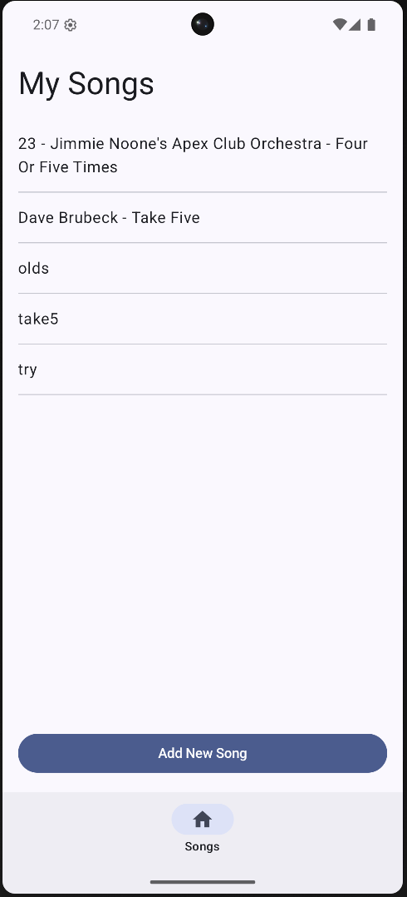
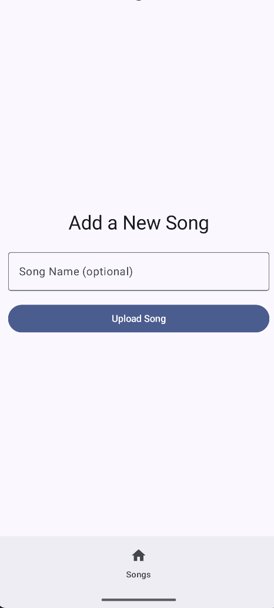
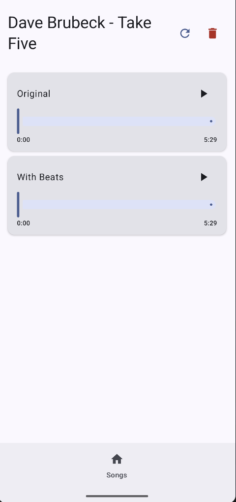

# UpBeat

A mobile app for music playback with beat detection.

## Screenshots

View the list of songs you added.  
Press Add song to upload a new audio file.  
Tap on a song to see the original and beat-enhanced versions side by side.

Optionally add a name to the song and select an audio file to upload.

Play either the original or beat-enhanced version of the song. The beat-enhanced version will have the detected beats and downbeats emphasized.

## Features

- 🎵 Upload and play audio files
- 🥁 Automatic beat detection
- ☁️ Cloud storage with AWS S3
- 🎧 Dual playback - Original and Beat-Enhanced versions

## Technologies

- **Android** - Kotlin, Jetpack Compose
- **Cloud** - AWS S3, Lambda, Cognito
- **Audio** - ExoPlayer, [BeatThis!](https://github.com/CPJKU/beat_this)

## Beat Detection

This app uses the BeatThis! beat tracking algorithm for audio beat detection:

> **BeatThis! - A Beat Tracking System Based on Recurrent Neural Networks**  
> Sebastian Böck, Florian Krebs, and Gerhard Widmer  
> Proceedings of the 17th International Society for Music Information Retrieval Conference (ISMIR), 2016  
> [GitHub Repository](https://github.com/CPJKU/beat_this)

## Setup

(Add setup instructions here)

## License

(Add license information here)

